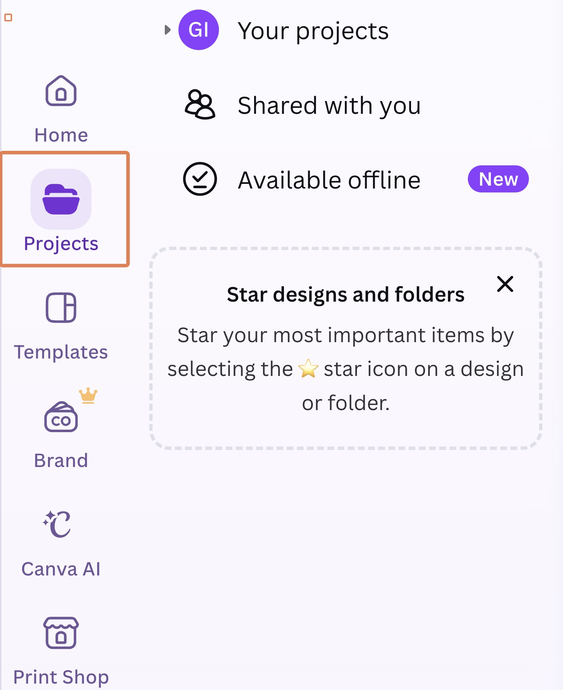
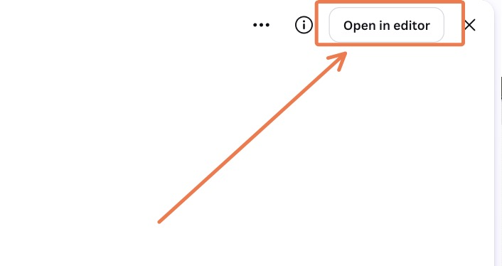
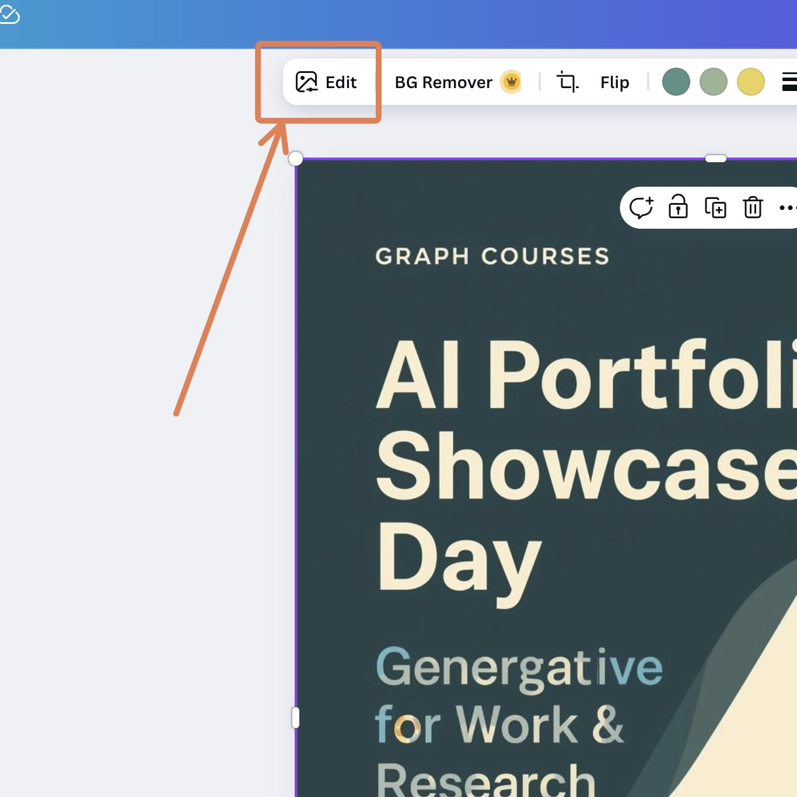
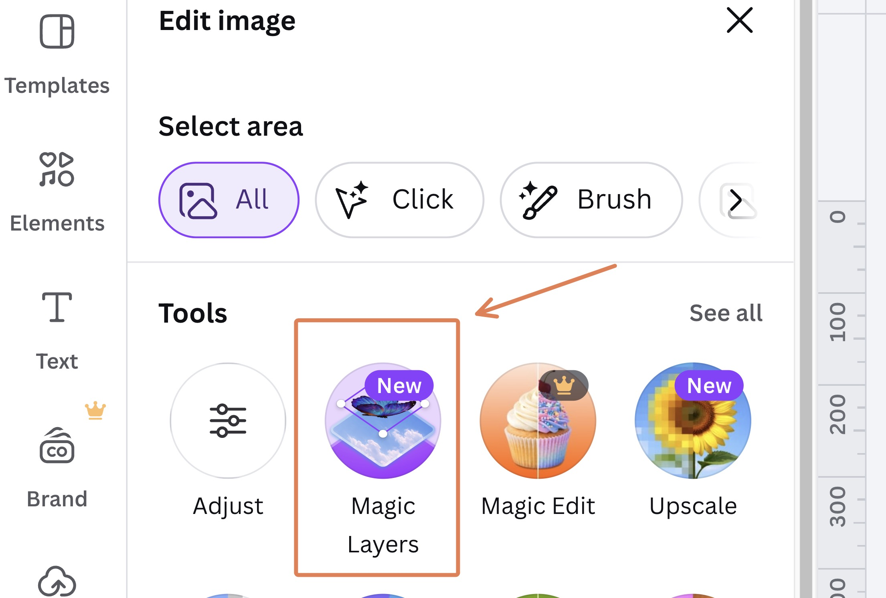
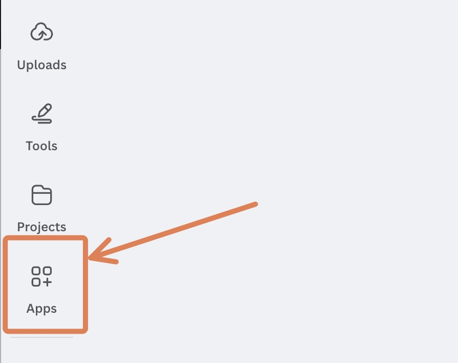
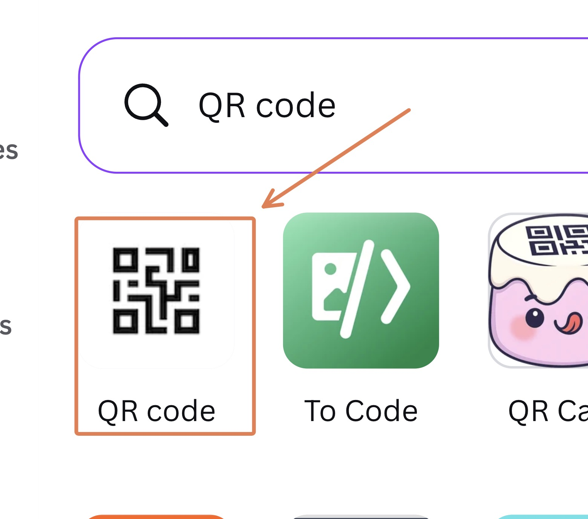
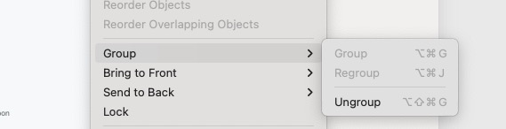
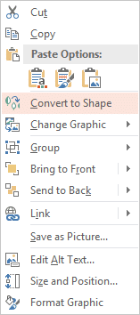

# Overview

In this session you will try two small but practical GenAI design workflows:

1.  **Create a promotional flyer** for our course showcase using **Gemini** to generate the initial image and **Canva** for final editing.

(You can share this flyer on your website or social media with colleagues and friends to get them to come to the showcase.)

2.  (**Optional challenge**) **Turn a research paper into a visual abstract** using **Claude** and **SVG**, and share your result in a comment on the workshop page.

# Task 1: AI Flyer for the Final Presentation

You'll generate the initial flyer image with **Gemini**, then bring it into **Canva** to fix the text and finalize it.

**Accounts Required**: You'll need a free **Google/Gemini** account (for [gemini.google.com](https://gemini.google.com/){target="_blank"}) and a free **Canva** account.

### 1-A Generate the Flyer Image in Gemini

For generating the flyer image, we will use Gemini, as it a decent free model for image generation. ChatGPT is also an option if you prefer it.

1.  Go to [gemini.google.com](https://gemini.google.com/){target="_blank"} and log in.

2.  In the prompt box, describe the flyer image you want to create. You can copy and paste the recommended prompt below, or write a similar but original one. 

    Side Note: We chose theme colors for you based on our GRAPH branding, but you can use your own colors if you prefer. A couple of ways to pick them:

    -   Go to [coolors.co/generate](https://coolors.co/generate){target="_blank"} and press the spacebar to generate palettes until you find one you like. Use the **6-character hex codes** (e.g. `1A7F8C`) rather than the color names.
    -   Or use your own brand colors: upload a screenshot of your brand (or your existing website) to an LLM and ask it to extract the main theme colors as hex codes.


Prompt to paste:
```
Create a modern, rich, professional flyer in 3:4 portrait dimensions for the following event:
► Main headline: "Generative AI for Work & Research: AI Portfolio Showcase Day".
► Date and Time: Sunday, June 28, 5pm GMT or Wednesday, July 1, 3pm GMT
► Incorporate these two theme colors: [#e5b44e], [#3a6c83].
► Leave some empty space in one corner for a QR code that we will add later.
► Include some lorem ipsum text that I will replace later.

```

4.  Press Enter to generate.

5.  If you're unhappy with the design elements of the generation, you can ask the model to make changes. For text-based elements and finishing touches, rather than asking the model to make changes, it is often easier to bring the image into a proper image editor where you can edit specific regions, collaborate with others, and finalize the text. That's what we'll do next with **Canva**.

6.  Once you're relatively happy with an image, download it. Hover over the top-right corner of the image and click the **download** button. Make sure to download the image in **PNG** format.

### 1-B Bring the Image into Canva

1.  Go to [canva.com](https://www.canva.com/){target="_blank"} and sign up for a free account or log in.

2.  In Canva, go to the **Projects** tab in the left sidebar.

{width="320"}

3.  Drag your downloaded flyer image into the empty space to upload it.

4.  Open the uploaded image, then click **"Open in editor"** at the top right.

{width="400"}

5.  In the editor, hover over the image and click the **"Edit"** button at the top left.

{width="519"}

This reveals the editing tools, including **Magic Layers**.

### 1-C Fix the Text with Magic Layers

1.  Click on the **Magic Layers** tool.

{width="500"}

2.  Canva will separate the image into editable layers, including the text. You can now click on the text layers, edit (or remove) the Lorem ipsum (placeholder) text, and fix any spelling or formatting errors.

### 1-D Add a QR code

A QR code can make it easier for people to register for the showcase.

1.  In the left-hand sidebar, click on "Apps".

{width="608"}

2.  Search for "QR code" and select the official Canva QR code generator.

{width="208"}

3.  Enter the registration link: `https://forms.gle/n9Xf8ocLd6JtWXUZA` and add the QR code to your flyer.

### 1-E Share & Upload

1.  Click the "Share" button at the top right of the Canva editor.
2.  Select "Download", keep the file type as PNG, and click "Download" again.
3.  Upload the downloaded PNG file to the assignment submission area on the course website.

# Task 2 : AI Visual Abstracts

In this section, we'll use AI and design tools to turn a research paper into a visual abstract. A visual abstract is a pictorial representation of the main findings of a research paper, and is a great way to communicate the key results of a paper in an appealing visual format.

**Account Required**: You'll need a free **Claude.ai** account. Sign up at **claude.ai** if you haven't already.

Other LLMs like ChatGPT and Gemini can also do this task, but we have found Claude consistently deliver better results.

### 2-A Choose Your Paper

Pick any recent research paper you are interested in and locate the title and abstract text. We use just the abstract rather than the full paper to avoid overwhelming the model with trying to visually represent too much information. You'll copy and paste these into Claude in the next step.

### 2-B Generate Visual Abstract with Claude

Go to **claude.ai** and log in to your account. For best results on the free plan, the recommended model is **Claude Sonnet 4.6**, set to the **high** effort/reasoning setting.

Use Claude to create an SVG-based "visual abstract" of your chosen paper with the following prompt or similar:

```
Create a rich, accurate, and visually appealing SVG code-based visual abstract in landscape format, light mode, of the following paper:

[Paper Title]
[Paper Abstract]
```

After Claude generates the initial design, you can ask it to make specific changes or improvements to refine the visual abstract. "For example, make the subtitle larger, italics and use a different color/font."

If you are happy with the design, you can take a screenshot and share it in a comment on the workshop page. Otherwise, for further edits, we will use PowerPoint to make the changes. 

### 2-C Edit and Finalize

If you want to make some custom edits, you can do so as follows.

1.  Around the top right of the image preview, there will be a **download** button. Use it to download the SVG file.

2.  Open PowerPoint and drag the downloaded SVG file into a slide.

3.  To make the elements editable, you then need to ungroup/convert the SVG:

-   **For Mac users**: Right-click on the image, click on "Group", then "Ungroup". You may need to repeat this process several times until there's nothing left to ungroup.



-   **For Windows users**: Right-click on the image and click on "Convert to shape".



4.  After converting the SVG, the font sizes are often too big. To shrink everything at once, select all objects in the slide and click the **"A" with the downward caret** (the "decrease font size" button) until the text fits.

5.  Some of the elements may have become malformed during the conversion process. You may therefore need to make some edits to individual elements.

6.  When finished, export as a PDF or take a screenshot of your slide.

------------------------------------------------------------------------

### 2-D Share Your Work as a Comment

When you're finished, upload your visual abstract (PDF, screenshot, or exported file) as a comment on the workshop page. Include a link to the original paper in your comment. This optional challenge is not part of the assignment submission.

# Task 3: Optional Challenge : Swap Out the Tools

To experiment with these two visual styles (SVG code-based design vs image-based design), you can swap out the tools you used in Task 1 and Task 2.

For Task 1, try to build a flyer using the SVG workflow above. 

Then for Task 2, try to build a visual abstract using the image-based workflow above.

Compare and contrast the approaches and results. What was easier? What was more difficult? What did you learn? You can share your thoughts in a comment on the workshop page.